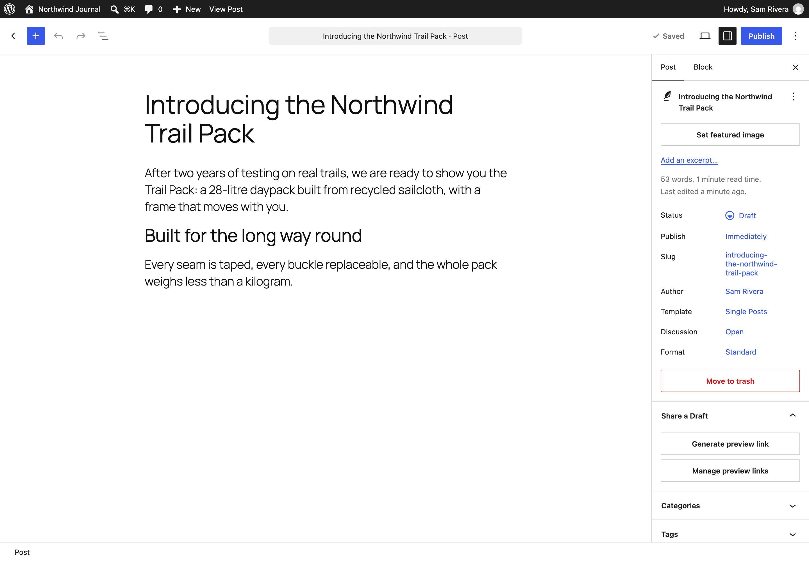
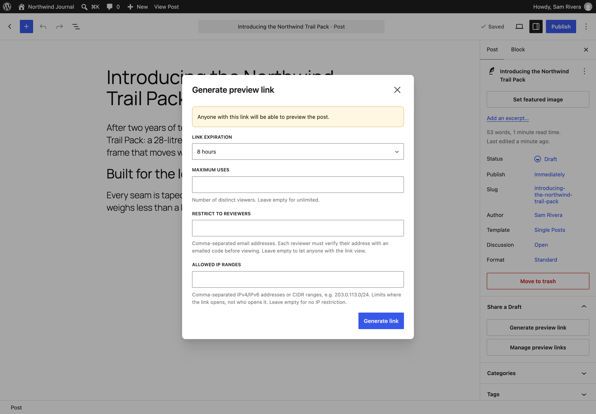
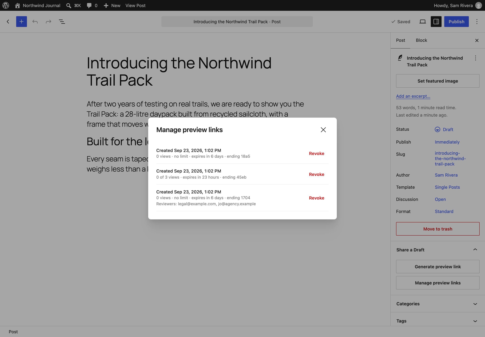
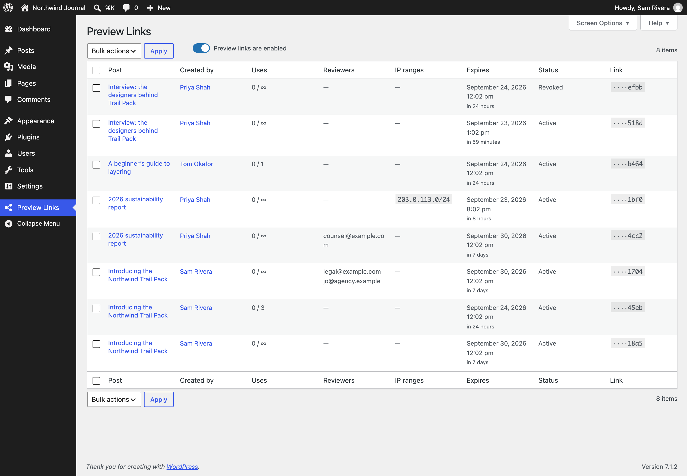
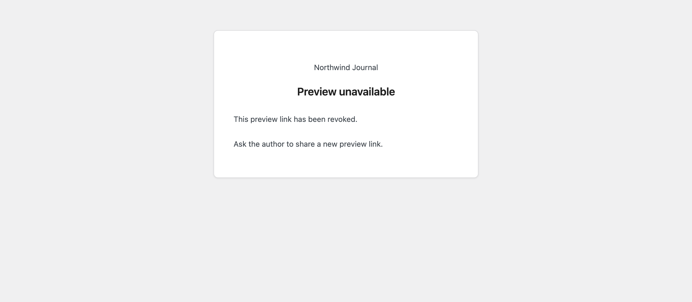

# Share a Draft

**Contributors:** nbachiyski, automattic, lessbloat, garyj  
**Tags:** draft, preview, share, sharing, review  
**Requires at least:** 6.9  
**Tested up to:** 7.1  
**Requires PHP:** 8.2  
**Stable tag:** 1.7  
**License:** GPLv2 or later  
**License URI:** https://www.gnu.org/licenses/gpl-2.0.html

Create a secure, time-limited link to a draft, so a reviewer without a WordPress account can read it before you publish.

## Description

Drafts in WordPress can only be seen by people who can edit them. When a client, a legal reviewer, or a colleague without an account needs to read a draft before it goes live, Share a Draft gives you a link for exactly that, and keeps you in control of it.

Open a draft in the block editor, choose **Generate preview link** in the Share a Draft panel, and send the link to your reviewer. They see the draft exactly as it will look when published, without logging in.

Every link is:

- **Private.** Only people with the link can open the draft. Links are kept out of search engines and page caches, and an unknown link is a plain "not found", so nobody can go looking for drafts.
- **Time-limited.** Choose how long the link lasts, from an hour to a week. Developers can [offer other lifetimes](https://github.com/Automattic/shareadraft/blob/main/docs/customizing.md#offer-different-link-lifetimes).
- **Use-limited, if you want.** Cap how many people can open it, down to a one-time link.
- **Bound to named reviewers, if you want.** List reviewers' email addresses, and each one confirms theirs with a one-time code before the draft opens, so a forwarded link is useless to anyone else.
- **Restricted to trusted networks, if you want.** Allow only certain IP addresses or ranges, such as your office network.
- **Revocable.** Switch off any link at any moment. A reviewer who returns to an expired or revoked link is told why it stopped working.

Links also tidy themselves up: they are discarded when a draft is published or trashed, and revoked when the person who created them is deleted.

Administrators get a **Preview Links** screen listing every link on the site, with who created it, how often it has been used, and when it expires. From there they can revoke links in bulk (for example, everything one person made, when they leave), or pause every link at once while investigating a suspected leak, then switch them back on. See [managing links](https://github.com/Automattic/shareadraft/blob/main/docs/managing-links.md) for the details, including hooks for your own offboarding process.

Developers can do all of this from the shell with [WP-CLI](https://github.com/Automattic/shareadraft/blob/main/docs/wp-cli.md) (`wp shareadraft create`, `list`, `revoke`, `prune`, `disable` and `enable`), or let AI assistants and MCP clients do it through the WordPress [Abilities API](https://github.com/Automattic/shareadraft/blob/main/docs/abilities.md), under the same rules and permissions as the editor. They can also [customize](https://github.com/Automattic/shareadraft/blob/main/docs/customizing.md) how links behave, from the lifetimes on offer to what reviewers are told.

Share a Draft works on any host, with nothing to configure. On [WordPress VIP](https://wpvip.com/) it is also available as an integration, with [hosting requirements already met and optional settings in the VIP Dashboard](https://github.com/Automattic/shareadraft/blob/main/docs/wordpress-vip.md).

### Upgrading from Share a Draft 1.x

Share a Draft 2.0 is a rewrite. Links made with 1.x keep working until they expire, and their owners can review and delete them under **Posts → Share a Draft (Old)**, which only appears while they have one. 1.x links cannot be extended; new links are made from the block editor. Support for 1.x links will be removed in 2.1.0.

## Installation

1. Install and activate Share a Draft from **Plugins → Add New Plugin**.
2. Open a draft in the block editor, and find the **Share a Draft** panel in the post sidebar.
3. Manage every link on the site under **Preview Links** in the admin menu.

There are no settings to configure. If your site sits behind a page cache, a reverse proxy, or a host that cannot send email, check the [hosting requirements](https://github.com/Automattic/shareadraft/blob/main/docs/hosting.md) first.

## Frequently Asked Questions

### Does my reviewer need a WordPress account?

No. Anyone with the link can open the draft, unless you have bound the link to named reviewers, in which case they confirm their email address with a one-time code first.

### What does the reviewer see?

The draft, rendered by your theme exactly as it will look when published. If the link has expired, been revoked, or been used up, they see a short notice saying so instead.

### Can I change a link after sharing it?

No. A link's lifetime and limits are fixed when it is created. To change them, revoke the link and generate a new one.

### I think a link has leaked. What should I do?

Revoke it from the editor or the Preview Links screen. If you are not sure which link leaked, an administrator can pause every link on the site at once from the Preview Links screen, and switch them back on when the dust settles. Pausing doesn't revoke or change any link: once links are switched back on, each one works again until its own expiry.

### Does it work with page caching?

Yes, as long as your page cache does not serve cached copies of preview requests. Almost every cache already skips them. The [hosting requirements](https://github.com/Automattic/shareadraft/blob/main/docs/hosting.md) explain what to check.

### Why do IP-restricted links fail behind my proxy or CDN?

Behind a reverse proxy, every visitor appears to come from the proxy's address. A few lines of code [tell Share a Draft the visitor's real address](https://github.com/Automattic/shareadraft/blob/main/docs/customizing.md#behind-a-reverse-proxy-tell-share-a-draft-the-visitors-real-ip-address).

### Can I turn off the reviewer email and IP restriction options?

Yes, with [a line of code each](https://github.com/Automattic/shareadraft/blob/main/docs/customizing.md#turn-off-named-reviewer-or-ip-restriction-features). The options disappear from the editor and the Preview Links screen, and links that already use them keep enforcing them.

### Where can I report a bug or contribute?

On [GitHub](https://github.com/Automattic/shareadraft). See the [contributing guide](https://github.com/Automattic/shareadraft/blob/main/CONTRIBUTING.md) to get started.

## Screenshots

1. The Share a Draft panel in the block editor's post sidebar.
2. Generating a link: how long it lasts, how many people can open it, and optionally who can open it and from where.
3. Managing a draft's links from the editor.
4. The Preview Links screen, listing every link on the site, with bulk revoking and a switch to pause every link.
5. What a reviewer sees when a link has been revoked.

## Changelog

All of the detailed changes are listed in [CHANGELOG.md](https://github.com/Automattic/shareadraft/blob/main/CHANGELOG.md).

## Upgrade Notice

### 2.0.0

A rewrite. Create links from the block editor and manage them under Preview Links. Links made with 1.x keep working until they expire, and can be reviewed or deleted under Posts → Share a Draft (Old), until 2.1.0.
